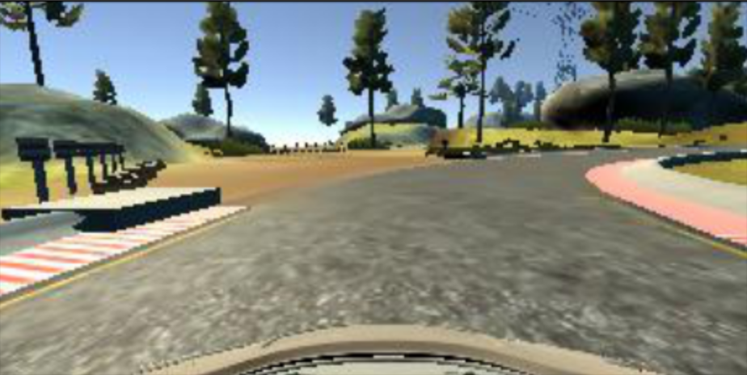

# Behavioral Cloning Project
[](http://www.udacity.com/drive)

---

This repo contains my solution to the Behavioral-Cloning Project for Udacity's Self-Driving Car Engineer Nanodegree Program.

---


**Behavioral Cloning Project**

The goals / steps of this project are the following:
* Use the simulator to collect data of good driving behavior
* Build, a convolution neural network in Keras that predicts steering angles from images
* Train and validate the model with a training and validation set
* Test that the model successfully drives around track one without leaving the road
* Summarize the results with a written report

---
### Files inculded

My project includes the following files:
* <code>model.py</code> - containing the script to create and train the model
* <code>drive.py</code> - for driving the car in autonomous mode
* <code>model.h5</code> - containing a trained convolution neural network 
* <code>run1.mp4</code> - a video of the model driving the car around the track in autonomous mode


### Model Architecture and Training Strategy

```python 

def modelNVIDIA(actFct='relu'):
    
    model = Sequential()
    model.add(Lambda(lambda x: (x / 127.5) - 1., input_shape = (160, 320, 3))) 
    model.add(Cropping2D(cropping=((66,22), (0,0))))
    model.add(Convolution2D(24,5,5,subsample=(2,2),activation=actFct))
    model.add(Convolution2D(36,5,5,subsample=(2,2),activation=actFct))
    model.add(Convolution2D(48,5,5,subsample=(2,2),activation=actFct))
    model.add(Convolution2D(64,3,3,activation=actFct))
    model.add(Convolution2D(64,3,3,activation=actFct))
    
    model.add(Flatten())
    model.add(Dropout(.5))
    model.add(Dense(1164))
    model.add(Activation(actFct))
    model.add(Dense(100))
    model.add(Activation(actFct))
    model.add(Dense(50))
    model.add(Activation(actFct))
    model.add(Dense(10))
    model.add(Activation(actFct))
    model.add(Dense(1))
    model.summary()
    model.compile(loss='mse', optimizer='adam')
    return model 
````

#### 1. Model architecture 

My model consists of a convolution neural network with 3x3 and 5x5 filter sizes and depths between 24 and 64.

The model includes RELU layers to introduce nonlinearity and the data is normalized in the model using a Keras lambda layer.


#### 2. Attempts to reduce overfitting in the model

The model contains dropout layers in order to reduce overfitting. The model was trained and validated on different data sets to ensure that the model was not overfitting. The model was tested by running it through the simulator and ensuring that the vehicle could stay on the track.

#### 3. Model parameter tuning

The model used an adam optimizer, so the learning rate was not tuned manually.

#### 4. Appropriate training data

Udacity sample data was used for training.

### Model Architecture and Training Strategy

#### 1. Solution Design Approach

The overall strategy for deriving a good model was to use the [Nvidia](https://arxiv.org/pdf/1604.07316v1.pdf) architecture since it has been proven to be very successful in self-driving car tasks.

In order to gauge how well the model was working, I split my image and steering angle data into a training and validation set. 

After training the model, the final step was to run the simulator to see how well the car was driving around track one.

At the end of the process, the vehicle is able to drive autonomously around the track without leaving the road.

#### 2. Final Model Architecture

The code of the final model is shown above. Here is a visualization of the architecture:


#### 3. Creation of the Training Set

For training, I used the following augumentation technique along with Python generator to generate unlimited number of images:

* Randomly choose right, left or center images.
* For left image, steering angle is adjusted by +0.2
* For right image, steering angle is adjusted by -0.2
* Randomly flip image left/right (and the related steering angle with -1)
* Cropping the image

Here are examples for each stage of the augumentation step:

<center> <h4>Center image</h4> </center>

<br>


<center> <h4>Left image</h4> </center>

<br>


<center> <h4>Right image</h4> </center>

<br>


<center> <h4>Flipped Image</h4> </center>

<br>


<center> <h4>Cropped image</h4> </center>

<br>


#### 4. Training Process

As stated above, the Udacity sample data was used for training. After the agumentation the model has been trained on 19286 images (80% of data) and validated with the remaining 4821 images (20% of data).

The network was then trained for 5 epochs:

```python
Epoch 1/5
19286/19286 [==============================] - 2095s - loss: 0.0079 - val_loss: 0.0117

Epoch 2/5
19286/19286 [==============================] - 2080s - loss: 0.0066 - val_loss: 0.0109

Epoch 3/5
19286/19286 [==============================] - 2061s - loss: 0.0049 - val_loss: 0.0101

Epoch 4/5
19286/19286 [==============================] - 2104s - loss: 0.0034 - val_loss: 0.0098

Epoch 5/5
19286/19286 [==============================] - 2055s - loss: 0.0021 - val_loss: 0.0102
```

---

### References

* Nvidia model: https://arxiv.org/pdf/1604.07316v1.pdf
